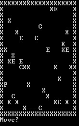

#Overview
  Hi! My name is Adam Quinn, and I'm excited to share with you this project, which I developed with my partner Natasha Thomas. The goal of this project is to demonstrate how a "Neural Network" can be evolved using a "Genetic Algorithm" to better complete a task---in this case playing a simple game called "Zombie Slayer." Below is an explanation of these technical terms, as well as authoring information and sample results. If you are already familiar with neural networks and genetic algorithms, feel free to go to "INSTALLATION.md" for information on how to setup this project or "USERGUIDE.md" for information on how to use it.
  
###Neural Networks
  A neural network is a method of creating a program to make decisions. A neural network is composed of several layers of "neurons" which each receive inputs, perform a mathematical operation on them, and produce a single output. The number of neurons in each layer, and the number of layers, varies from neural net to neural net---a larger number of neurons creates a smarter, but slower network---but no matter the size, the neural network operates by receiving a set of inputs from the environment, running them through each neuron layer, and producing a set of outputs that corresponds to possible actions the neural network could take. For example, our neural network has a layer of six neurons that receive ten input values, then pass their results to a layer of three output neurons that produce a set of three outputs.
  For a more in-depth (but still layman-friendly) explanation of neural networks, see: 
  http://www.ai-junkie.com/ann/evolved/nnt1.html
  
###Genetic Algorithms
  A genetic algorithm is an algorithm that attempts to maximize a certain value using methods that mimic evolution. In our project, we use a genetic algorithm to tweak the variables that determine what calculations each neuron in a neural net performs on its inputs---the better these calculations, the better the neural net's performance. Our genetic algorithm works by producing a "first generation" with random values, then taking the best-performing neural nets from this generation and splicing their genomes together to create new neural networks (just as evolution splices the genomes of fit members of a species through sexual reproduction). For an explanation of the process through which this splicing occurs, see: http://www.ai-junkie.com/ga/intro/gat1.html
  
###The Game
  "Zombie Slayer" is an ASCII-graphics turn-based game in which a player ("P") moves around a map (with walls labeled "X") trying to kill zombies ("E") before the zombies bite civilians ("C") turning them into more zombies. In the single-player version of the game (which can be found in this project as "Zombie Slayer (Single Player).py") a human is asked each turn to enter either w/a/s/d (to move) or "k" to use the player's knife to kill all adjacent zombies. In the Neural Network version of the game, the Neural Network chooses which of these moves to make as a result of values that the game sends to it.
  
  A SAMPLE GAME:
  

#Sample Results

#Authoring Information
This project was contributed by: Adam Quinn and Natasha Thomas

Special thanks to the University of Illinois NetMath Program and the mathematics department at William Fremd High School

After work by the creators of http://doublezoom.free.fr and http://www.ai-junkie.com/index.html
